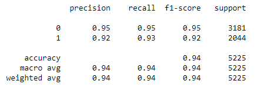

# BikeSharingDataMining
<!-- ALL-CONTRIBUTORS-BADGE:START - Do not remove or modify this section -->

<!-- ALL-CONTRIBUTORS-BADGE:END -->

## Overview

This project aims to create programming solutions using data mining techniques for given problem.

The dataset used in this project is about the historical bike-sharing data in London from 4 January 2015 to 3 January 2017. The dataset shows the count of bikes rented every hour in London with its related parameters.

Note: The dataset is retrieved from https://www.kaggle.com/hmavrodiev/london-bike-sharing-dataset

### Metadata
|     Column          |     Description                                                                                                                                                                                                       |
|---------------------|----------------------------------------------------------------------------------------------------------------------------------------------------------|
|     timestamp       |     Date and time of day for grouping the data                                                                                                                                                                        |
|     cnt             |     The count of a bike rented                                                                                                                                                                                        |
|     t1              |     Real temperature in °C                                                                                                                                                                                            |
|     t2              |     “Feels Like” temperature in °C                                                                                                                                                                                    |
|     hum             |     Humanity in percentage(%)                                                                                                                                                                                         |
|     wind_speed      |     Wind speed in km/h                                                                                                                                                                                                |
|     weather_code    |     Category of weather   1 = Sky Clear or Mostly Clear   2 = Scattered or Few Clouds   3 = Broken Clouds   4 = Cloudy   7 = Rain   10 = Rain with thunderstorm   26 = Snowfall   94 = Freezin fog    |
|     is_holiday      |     Boolean field to determine the day is holiday   0 = non holiday   1 = holiday |
|     is_weekend      |     Boolean field to determine the day is weekend   0 = non weekend   1 = weekend  |
|     season          |     Categorical field for metrological season   0 = Spring   1 = Summer   2 = Autumn   3 = Winter  |

### Problem
The main problem with this dataset is to analyse and predict the count of the bikes shared. It is essential to perform prediction on the count of bikes shared as it could help to identify the trend and behaviour patterns in the bike-sharing system. By forecasting the outcome on the count of bikes shared, we can gain more insights that can lead to a more effective business and a better investment decision. As there are many parameters such as temperature, humidity, time and others that influence the count of bike shared, we can analyse the correlation between the parameters with the count of bike shared and develop some models to predict the prediction of the count of bike shared.

### Solution
This project contains two parts:

1. Exploratory Data Analysis and Visualization 
Exploratory data analysis (EDA) is an approach in analyzing data sets to summarize their main characteristics, often with visual methods. It is used to derive useful information / knowledge / pattern from raw data.

2. Development of Data Mining Models
Develop effective models to predict the count of bikes shared. 
To perform the classification algorithm on the dataset, we convert the count of bikes shared into 2 bins, which are lower than average and higher than average. 
The models that will be used in this project are as follows:

#### Classification Models
1. Logistic Regression
2. K-Nearest Neighbour (KNN)
3. Random Forest Classifier
4. DecisionTree Classifier

#### Clustering Models
1. KMeans
2. Gaussian Mixture
  
## Tools
1. Anaconda distribution package
2. Jupyter Notebook

## Usage
Import the files into your project. 
Run the project with Juypter Notebook.

## Test
No test has been performed.

## Previews

### Exploratory Data Analysis and Visualization
1. Average Count of Bikes Rented based on the Weather in London     
2. Correlation Matrix Plot / Heatmap     
3. Average Count of Bike Rented based on Hour during Weekend & Weekday     
4. Average Count of Bike Rented based on Hour during Holiday & Non-holiday     
5. Count of Bike Rented in Days with respect to Seasons     
6. Count of Bike Rented with resect to 'Feels Like' Temperature     
  
### Development of Data Mining Models

#### Classification Models
1. Performance Matrix of Logistic Regression     
2. Performance Matrix of K-Nearest Neighbour (KNN)     
3. Performance Matrix of Random Forest Classifier     
4. Performance Matrix of Decision Tree Classifier     

#### Clustering Models
1. KMeans     
2. Gaussian Mixture     

## Contributors ✨

Thanks goes to these wonderful people ([emoji key](https://allcontributors.org/docs/en/emoji-key)):

<!-- ALL-CONTRIBUTORS-LIST:START - Do not remove or modify this section -->
<!-- prettier-ignore-start -->
<!-- markdownlint-disable -->
<table>
  <tr>
    <td align="center"><a href="https://github.com/yuanjie8629"> <b>Tan Yuan Jie</b></a> <a href="https://github.com/yuanjie8629/BikeSharingDataMining/commits?author=yuanjie8629" title="Code">💻</a> <a href="#data-yuanjie8629" title="Data">🔣</a> <a href="https://github.com/yuanjie8629/BikeSharingDataMining/commits?author=yuanjie8629" title="Documentation">📖</a> <a href="#ideas-yuanjie8629" title="Ideas, Planning, & Feedback">🤔</a> <a href="#infra-yuanjie8629" title="Infrastructure (Hosting, Build-Tools, etc)">🚇</a></td>
    <td align="center"><a href="https://github.com/lwleo02"> <b>lwleo02</b></a> <a href="https://github.com/yuanjie8629/BikeSharingDataMining/commits?author=lwleo02" title="Code">💻</a> <a href="#data-lwleo02" title="Data">🔣</a> <a href="https://github.com/yuanjie8629/BikeSharingDataMining/commits?author=lwleo02" title="Documentation">📖</a> <a href="#ideas-lwleo02" title="Ideas, Planning, & Feedback">🤔</a></td>
  </tr>
</table>

<!-- markdownlint-restore -->
<!-- prettier-ignore-end -->

<!-- ALL-CONTRIBUTORS-LIST:END -->

This project follows the [all-contributors](https://github.com/all-contributors/all-contributors) specification. Contributions of any kind welcome!